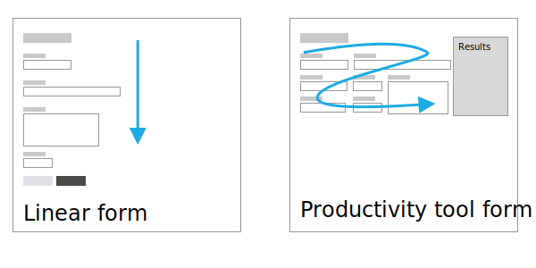

---
#
# Layout. Use page
layout: page

# Id is necessary for PDF conversion. It should be the same as the
# name of the file.

id: guidelines

# Is it displayed on the navigation bar?
in-navbar: true

# Visible title.
title: Design Guidelines
---

## What are these guidelines?

These guidelines establish a set of best practices and rules about how to
design an internal web application for UNICEF.

These guidelines are especially oriented to productivity web applications rather
than communication web sites.

Also, consider these guidelines as a live document. Although, principles rarely
change, context, technology and tools do. To keep these guidelines useful,
they need to evolve.

## Who is expected to use these guidelines?

Anyone who has to define the user interface of a digital web application within
or for UNICEF, typically a user experience designer and/or product owners.

## Principles

Our design principles are the roots, the core, the foundation. All our design
decisions are based on the following principles.

1. **Lean design, for slow Internet connections**.
    Because UNICEF staff is working on many countries with slow Internet
connections, every design has to be fast and nimble.

2. **Design for all, no matter your tech savviness**.
Explicit and obvious design for all, because no matter how tech savvy you are,
our apps shall be easy to use and understand. For example, we always display
icons with labels, use the minimum amount of words that convey one single
complete meaning, in case of doubt we prefer more words.

3. **Accessible for all, regardless of disability**.
Because in UNICEF every single person is important, design shall be accessible
for all.

4. **Design is as little design as possible**.
Less, but better – because it concentrates on the essential aspects, and the
apps are not burdened with non-essentials.

5. **Consistent designs**.
In visual style, labeling, layouts and processes. Because we don’t reinvent the
wheel in every project and users don’t need to learn new conventions for every
tool. But we understand we use a very diverse set of technologies. A best effort
shall be approached.

6. **Made by UNICEF**.
Because we love UNICEF, designs present UNICEF brand core values and principles,
in a subtle and humble way.  

## Implementing these guidelines in your design

Within UNICEF there is a wide variety of projects, some are completely new, some
depend on legacy systems, some just need a few tweaks, some are just platforms
with an out of the box customization, etc. With this diversity, designers will
not always be able to fully comply with this specification.

## Download Visual Specification

We have created a [Sketch](https://www.sketchapp.com/) document that
contains the visual specification of each component. You can use this
file as [library for your designs](https://sketchapp.com/docs/libraries/).

<a class="btn btn-outline-primary" href="./assets/UNICEF-Designy-system.pdf">Download Visual Specification (.Sketch)</a>
<a class="btn btn-outline-primary" href="./assets/UNICEF-Designy-system.pdf">Visual Specification (.PDF)</a>

## Brand colors

In UNICEF brand book defines the following colors:

  
$unicef-blue

  
$unicef-dark-blue

  
$unicef-purple

  
$unicef-red

  
$unicef-dark-red

  
$unicef-orange

  
$unicef-green

  
$unicef-dark-green

We use `$unicef-blue` mainly on header.

Typically we use the `$unicef-dark-blue` on elements with actions.

## Traffic light colors
We use the traffic light colors metaphor for indicating status or result.

1. 
Success

    **Green color means success**: Some task was finished successfully. For
example, display a notification after the user successfully saved the contents
of a form.

2. 
Warning

    **Orange and yellow mean warning**: This color warns the user that there is
something that he may need to pay attention. Something exceptional, something
that is important for him to know, but does not stop him to continue advancing
in the flow.

3. 
Danger

    **Red means error or danger**: This color says the user that there is
something that is preventing him to continue with the regular flow. For example,
user forgot to fill a mandatory field.

    Red also may indicate danger, because the user is a going to perform a
    destructive action

    In general, because of the negative implications of the red color, we should try
to avoid using it in excess.

Note that we never use color as the unique cue in the interface to indicate the
status/result, as there may be colorblind users.

  We use the color to reinforce the message, but the message itself should have complete meaning without any color.

## Typography

For keeping the weight of the HTML low, we haven't defined a default typography
other than the default font of the operating system the user is running. For
example, in Windows 10 is `Segoe`.

**References**

 * [Using UI System Fonts In Web Design: A Quick Practical Guide](https://www.smashingmagazine.com/2015/11/using-system-ui-fonts-practical-guide/)

## Headings

Headings `h1` to `h6`.

  1. Follow a hierarchy. For example, under `h4`, there cannot be a `h3`.
  2. Although, it is typical to use the brand color on headers, we use a black
  color because UNICEF blue may be confused with a link. We are using UNICEF
  blue for links.
  3. Do not jump hierarchies. After `h1` there should be `h2`, but not `h3` or `h4`. This is important for text readers, as users can navigate through headings.
  4. Only one `h1` per page. It shall be the title of the page.
  5. Make your heading content: short, specific and clear.

## Text and labeling

Labels are the texts that appear on the interface next to form fields or within buttons.

Define a good labeling is one of the most difficult tasks when designing a good user interface and it should be conscientiously thought.

The following rules are recommended.

1. Labels shall be univocal, that is, they must convey one single meaning to all users.

2. Labels shall be short, the sorter, the better. For example, between the labels "Do you need help?", or a simply "Help", we would chose the latter. It conveys exactly the same meaning but in less words. The same with the following examples:

    | Worse                                  | Better                      |
    | -------------------------------------- |:----------------------------|
    | Go to next step                        | Continue                    |
    | Where to find more information         | More information            |
    | Join our team                          | Jobs                        |

3. Labels shall be as precise as possible. For example, the submit button in a form to request a vacation, instead of generic "Submit", a "Request vacation" would be preferred. Although, a bit longer, it helps the user to understand better what is the action he is performing.

4. Labels shall be consistent across the whole interface. For example, if "Delete" is used in one page, it should be used in all pages, avoiding the use of "Remove" or "Eliminate".

5. Labels should have sentence case. For example, use "Request vacation" and do not use "Request ~~V~~acation" (capital V in vacation).

6. We do not use two dots after labels. Example:

  

    

      <label for="exampleInputEmail1">Email address</label>
      <input type="email" class="form-control" id="exampleInputEmail1" aria-describedby="emailHelp" placeholder="Enter email">
    

  

7. Buttons perform actions, therefore, labels contained in buttons shall include a verb. For example a button with the label _Edit_ is ok, but _Edition_ is wrong.

    These are the standard labels any interface should use:

    | Label         | Action                      | Do not use              |
    | ------------- |:----------------------------|:------------------------|
    | Add           | Create a new item           | Create, Build,          
    | Cancel        | Abandon current action      | Dismiss, Abandon        
    | Continue      | Go to next step             | Next, Following         
    | Delete        | Delete an existing item     | Remove, Eliminate, Suprime
    | Edit          | Modify an existing item     | Modify, Change          
    | Save          | Save into a system an item  | Submit, Commit          
    | Upload        | Load a file from local computer or other system    | Import         
    | Download      | Save to a local computer    | Export                     
    | Print         | Print current page or section | Export                     

    However there may be some exceptions as "New post"

<strong><i class="fas fa-recycle"></i> Sustainability guideline:</strong>, in order to minimize paper usage, whenever
possible define a <strong>download</strong> action instead of a print action.

## Icons

In general, icons shall always be accompanied with a label. Exceptionally, a tooltip is allowed.

A recommended icon set is **[FontAwesome 5.x free](https://fontawesome.com/)**.

In order to keep consistency on the meaning of most common actions, the icon shall be

| Icon                                      | Action                      | Icon description        
| ------------------------------------------|:----------------------------|:------------------------|
| <i class="fas fa-pencil-alt"></i>         | Edit                        | A pencil                
| <i class="fas fa-times"></i>              | Close                       | An X                
| <i class="fas fa-trash-alt"></i>          | Delete                      | An trash can                
| <i class="fas fa-print"></i>              | Print                       | A printer                
| <i class="fas fa-upload"></i>             | Upload                      | An arrow exiting from a hard disk                
| <i class="fas fa-download"></i>           | Download                    | An arrow going to a hard disk.                
| <i class="fas fa-search"></i>             | Search                      | A magnifier                

The following icons are not recommended to be used

| <i class="fas fa-save"></i>         | Save                        |  A floppy drive is something from the past                       |

## Images

Images should weight the least amount possible. We work on environments on which the Internet is still not reliable.
So, minimizing the use and size of images is a must.

1. Use the format that weights for the size and quality you require. Typically, it is recommended to use JPG format for pictures and SVG for graphics and icons.

2. Use size optimizers such as [svgo](https://github.com/svg/svgo) or [jpeg optim]( https://github.com/tjko/jpegoptim).

3. It is necessary to set the `alt` description on all images. Keep this description brief, describe what you see and do not interpret the contents of the image. For decorative images, use an empty string `alt` attribute (`alt=""`).

### Date format

Recommended date format is `dd-MMM-YYYY`. For instance: `01-Feb-2018` or `10-Mar-2020`.

**Never use the format `dd/mm/yyyy` or `mm/dd/yyyy** as it is confusing. For instance,
`02/01/2020`, dependeing on the country it can be interpreted either as `01-Feb-2020` or `02-Jan-2020`.

### Numbers and currencies format

By default, we stick to English numbers. Separate thousands, millions, etc. with `,` and decimals with `.`. Example: `3.14159`, `1,200,000`.

For currencies prepend the currency symbol to the number and use always two decimals. Example: `$123,456,789.00`, `€1,200.00`.

You can skip decimals if they are not relevant (`$1,200`), but if you include them, always use two (~~`$1,200.3`~~).

  Note: Applications with internationalization support may override this
  recommendation.
    For example, in Spanish is more common to write one million euros as <code class="highlighter-rouge">1.000.000,00€</code>.

**References**

  * [UI Text for Web parts - Sharepoint Documentation](https://docs.microsoft.com/en-us/sharepoint/dev/design/ui-text-for-web-parts)

## Forms

Forms shall be designed the following way:

1. Fields shall be ordered from more important to less important, leaving optional fields at the end.

2. Related fields must be close to each other. For example, when residential address, zip code and country are requested, these must be close to each other as they are related.

3. Form fields shall be ordered in a logic way and/or following most common conventions. For example, in a login page, the username is requested before the password.

4. The size of the fields should reflect the expected size of its contents.

    

      <form>
        

        
Don't

          <label for="year-long">Year</label>
          <input id="year-long" class="form-control" type="number" placeholder="2018" />
        

        

        
Do

          <label for="year-ok">Year</label>
          <input id="year-ok" class="form-control" type="number" placeholder="2018" />    
        

      </form>
    

5. Form elements always have a label.

    

      <form>
        

        
Don't

          <input id="year-long-2" class="form-control" type="number" placeholder="Year" />
        

        

        
Do

          <label for="year-ok-2">Year</label>
          <input id="year-ok-2" class="form-control" type="number" placeholder="2018" />    
        

      </form>
    

   There may be a few exceptions in which a form element does not need a label. For example, a search box:

   

     

       <input class="form-control py-2" type="search"
         placeholder="Example: John Doe" >
       
         <button class="btn btn-primary" type="button">
           Search
         </button>
       
     

   

6. Numerical input fields shall be aligned to the right (to ease reading)

    

      

        <label for="number-left1">Number 1</label>
        <input name="number-left1" class="form-control" type="number" value="11.34">
      

      

        <label for=" number-left2">Number 2</label>  
        <input name="number-left2" class="form-control" type="number" value="11.34">
      

    

7. Currency fields:
    1. Shall not allow the user to introduce more than 2 decimals.
    2. Shall not allow the user to introduce any character not allowed.
    3. On blur, shall rewrite the contents to its

8. Use readonly and disabled fields properly. A field that just displays information and user can never change it is a read only field (html attribute `readonly`). A field that the user cannot modify because of the current status of the form are `disabled`. Example:

  
You need admin permissions to edit the birthday. Please, request access to the admin.
  

  

    

      <label for="date-disabled">Birthday</label>
      <input name="date-disabled" class="form-control" type="text" value="05 Sep 1999" disabled>
    

    

      <label for="date-readonly">Older than 18?</label>
      <input name="date-readonly" class="form-control" type="text" value="Yes" readonly>
    

  

In the example above, the birthday field is disabled because user does not have permissions. However, Older than 18? field is read only, because it only displays information.

<!--
`TODO improve description of currency fields behavior`
-->

## Forms Layout
There are two ways of arranging fields in a form. The first one is in a linear way, with one field per line, that is, by displaying one field above the next one. The second way to arrange a form is the productivity tool form. In these kinds of forms the layout groups elements to maximize the number of fields visible in the screen.

Linear forms are recommended for tasks sporadically done, tasks generally performed by users new to the system or while creating a new item. This layout it helps the user to sequentially fill the form.

However, for repetitive tasks expected to be done by users recurrently in productivity tools, it is recommended to follow the second approach, that is, try to display more elements in the screen. It allows users to analyze and edit more information without scrolling. These layouts are particularly useful for applications in which
changes of value in interactive elements change values in results areas.

**Horizontal forms are not recommended**. These forms place the labels are on the left of the field. Because of the distance between the label and the field are harder to fill for the user, also, these may have more problems with responsive design..

  <form>
  
Don't

    

      <label for="inputEmail3" class="col-sm-2 col-form-label">Email</label>
      

        <input type="email" class="form-control" id="inputEmail3" placeholder="Email">
      

    

    

      <label for="inputPassword3" class="col-sm-2 col-form-label">Password</label>
      

        <input type="password" class="form-control" id="inputPassword3" placeholder="Password">
      

    

  </form>

References
  * [Designing more efficient forms](https://uxplanet.org/designing-more-efficient-forms-structure-inputs-labels-and-actions-e3a47007114f)

# Form validations

Client side validation of form fields shall be done at field level:

1. **After losing focus** if the field does not have an error when the field gets the focus. We avoid displaying the error before the user has finished and believes it is correct. Imaging filling you email account into a field that once you type the first letter tells you that it is not correct, you may think: Hey man! Let me finish first!

2. **On every change (ie: key up)** if the field has an error when the field gets the focus. This approach informs the user the value is valid as soon as the error is solved.

Error messages are displayed contextualized under the field that is causing that error. These messages shall include:

  1. What went wrong and possibly why.
  2. What is the next step the user should take to fix the error.

And they should avoid using technical jargon and be as short and concise as possible.
In case, we don't have space, we should try to focus on how to fix the error.

<!--
`TODO: Define a set of standard errors.`
-->

## Buttons

We have the following types of buttons:

<button class="btn btn-primary">Primary button</button>
<button class="btn btn-outline-primary">Default button</button>
<button class="btn btn-outline-danger">Danger button</button>

**Primary buttons** allow the user to continue with the regular
flow, typically has the save, continue, send actions. It is the most visually prominent on the interface.

**Default buttons** are those that allow the user to perform secondary
actions such as cancel go to previous step.

**Danger buttons** are exclusively reserved for destructive actions (such as delete an item). They require to display an undo notification (preferred) or to display a confirmation popup before performing the action.

<!--
`TODO define how an undo notification looks`
-->

In a form buttons are aligned to the left. Except in popups that are aligned to the right.

<!--
`TODO example`
-->

The order of the buttons should be from left tor right: from least
important action to primary/main action.

## Modal windows (Popups)

In general, the use of popups shall be rationalized as they are not friendly on mobile and tablet devices.

<!--
`TODO provide alternatives that shall be used`
-->

In case of using them, these shall not include flows within them. Popups shall be used either to display some additional information or to fill a short subform.

Popups shall not be used to notify users about errors while filling a form or system errors. Use notifications, alerts and field errors for this purpose.

## Tables

Tables fields should be organized following this pattern from left to right:

1. Id (only displayed if necessary).
2. Most important information in the row.
3. Least important information in the row.
4. Action links.
5. Alignment
  1. In general, columns are aligned to the left except last column that should be aligned to the right.
  2. Numberical columns and dates shall be always aligned to the right (to ease reading).

<!--
`TODO provide an example`
-->

<!-- <table class="table">
<thead>
<tr>
  <th>hola</th>
</tr>  
</thead>
<tbody>
</tbody>
</table>
-->

In case selection of individual rows is provided, it should be displayed at the left side.

<!--

`TODO example of row with selection`

-->

## Asynchronous communication

Whenever the system is performing an action in background the user interface shall provide any kind of visual feedback to indicate the user this status.

<!--

`TODO expand this topic`

-->
