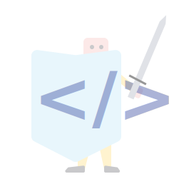

---
# Feel free to add content and custom Front Matter to this file.
# To modify the layout, see https://jekyllrb.com/docs/themes/#overriding-theme-defaults

layout: home
---

  <h1 class="display-4">UNICEF Design System</h1>
  
Modern, consistent, user friendly and accessible user interface.

  

    

      
      <h2 class="card-title">For designers and product managers</h2>
      
List of the specs of all controls.

      <a href="guidelines.html" class="btn btn-outline-primary">Design Guidelines</a>
    

    

          

          <h2 class="card-title">For developers</h2>
          

            We have created a reference implementation based on Bootstrap.
          

          <a href="developer-docs.html" class="btn btn-outline-primary">Developers docs</a>
          <a href="http://github.com/unicef/unicef-design-system" class="btn btn-link">GitHub</a>
  

<!-- jumbotron -->
